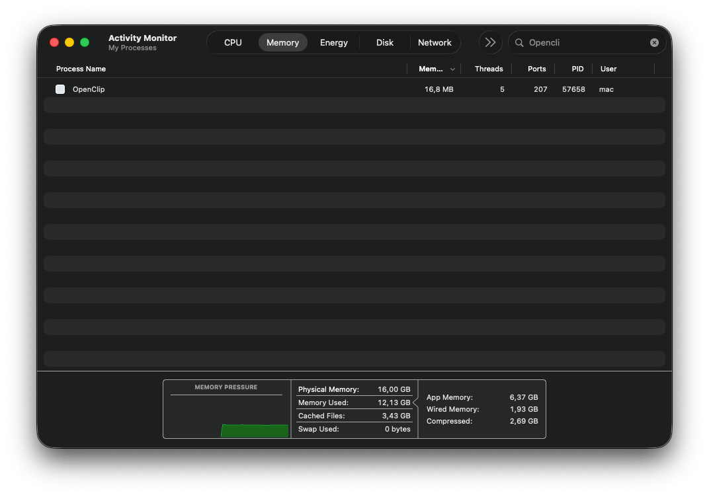
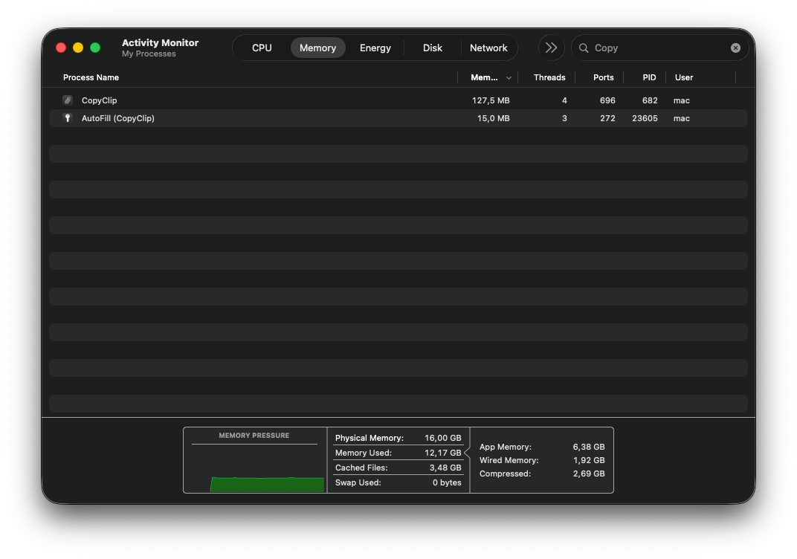

<div align="center">

# ✂️ OpenClip
**The Ultimate CopyClip Killer for macOS**

<p align="center">
  <a href="README.md">🇬🇧 English</a> •
  <a href="README.ru.md">🇷🇺 Русский</a>
</p>

[](https://www.rust-lang.org/)
[]()
[](LICENSE)
[]()

**OpenClip** is an ultra-lightweight, lightning-fast, and highly secure clipboard manager built natively for macOS in Rust. It was designed with a single goal: **to be the absolute best CopyClip replacement** by winning the battle for every byte of RAM while maintaining an elegant Apple-style aesthetic.

</div>

---

## ⚡ Why OpenClip? (The "CopyClip Killer")

Most clipboard managers today (even the popular ones like CopyClip or those built on Electron) consume an unacceptable amount of system resources, sometimes ballooning to hundreds of megabytes in the background.

OpenClip uses a **Micro-service Architecture**:
- The background daemon is stripped of all graphics and 3D rendering engines, keeping your base memory consumption to the absolute mathematical minimum (~15-20 MB private memory, or ~65MB RSS due to macOS shared frameworks).
- The beautiful **Preferences GUI** only spawns when you need it and completely terminates when closed, instantly freeing all graphics memory!
- Completely **Free & Open Source**.

---

## 🔒 Military-Grade Security
Your clipboard history contains your most sensitive data (passwords, crypto keys, private messages). 

* **AES-256-GCM Encryption**: Your clipboard history is fully encrypted on disk. It is mathematically impossible to read without the key.
* **Apple Keychain Integration**: The encryption key is securely stored in your Mac's native Keychain. No keys are ever saved in plain text.
* **No Telemetry, No Internet**: OpenClip runs 100% locally on your machine.

---

## 💾 Extreme Optimization (LZ4 Compression)
OpenClip implements industrial-level memory management:
- Instead of keeping raw gigabytes of text in memory, OpenClip **compresses your history on-the-fly using the blazing-fast LZ4 algorithm**.
- Only a tiny 37-character "preview" is kept in RAM to render the menu instantly. The massive text chunks are decompressed only in the exact millisecond you click to paste them!

---

## 📸 Screenshots: OpenClip vs CopyClip

| 🌟 OpenClip (Modern & Native) | ❌ CopyClip (Old Design) |
|:---:|:---:|
|  |  |

*A beautiful native dark mode experience built with modern design principles.*

---

## 🚀 Installation & Build

Ensure you have [Rust](https://rustup.rs/) installed.

```bash
# Clone the repository
git clone https://github.com/your-username/OpenClip.git
cd OpenClip

# Build both the background daemon and the GUI
cargo build --release

# The compiled application will be ready in the OpenClip.app bundle!
```

---

<div align="center">
Made with ❤️ in Rust for macOS users who care about every byte.
</div>
